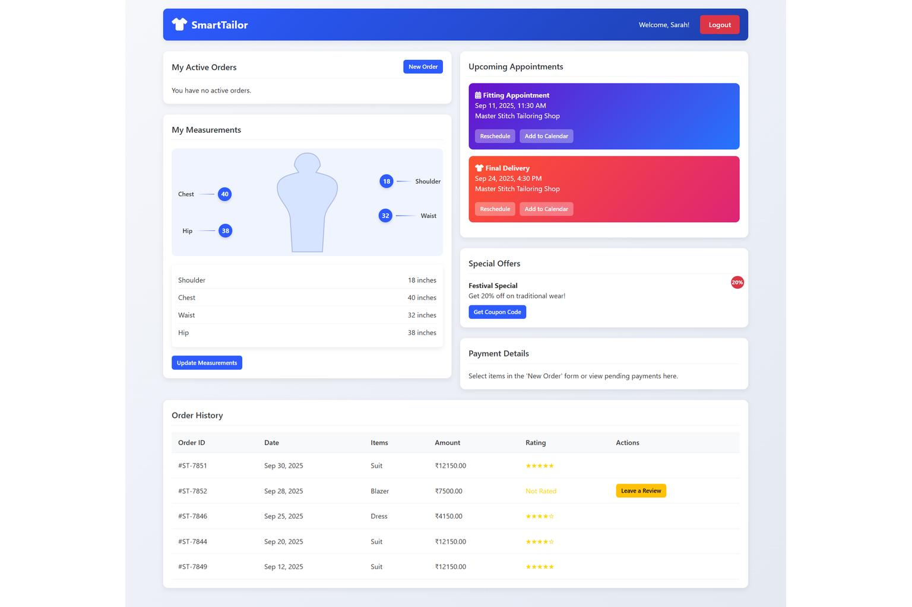

## 👕 SmartTailor

## 🔍 Overview
**SmartTailor** is a responsive, dual-dashboard web application designed to digitize and streamline the workflow for tailoring businesses and their customers. The customer dashboard allows users to place new orders, track their progress in real-time, manage measurements, and schedule appointments. The tailor dashboard provides a comprehensive business overview, including order management, customer relationship tools, a due-date calendar, and financial metrics. Built with React (via CDN), this project showcases the creation of a dynamic and interactive single-page application (SPA) from the ground up.

## 📸 Screenshots


## ✨ Features
  - ✅ Dual-Role Dashboards: Separate, feature-rich interfaces for both **Customers** and **Tailors**.
  - 🔐 User Authentication: A simple and secure login system to access the respective dashboards.
  - 📊 Interactive Order Tracking: Customers can track their order status through a visual timeline, from confirmation to delivery.
  - 📝 New Order Management: Customers can submit detailed new orders, while tailors can update their status, progress, and payment information.
  - 📏 Visual Measurement Management: Customers can view and update their body measurements, which are displayed on an interactive silhouette.
  - 📅 Appointment & Delivery Scheduling: Customers can reschedule appointments, and tailors can view all due dates on a master calendar.
  - ⭐ Review and Rating System: Customers can leave feedback on completed orders, which tailors can view to monitor satisfaction.
  - 🤖 Integrated Chatbot: A helpful chatbot on the customer dashboard to answer frequently asked questions.
  - 📱 Fully Responsive Design: A clean, modern UI that works seamlessly on both desktop and mobile devices.


## 🧠 How It Works
  - The application is a **Single-Page Application (SPA)** built with **React** (loaded via CDN), eliminating the need for a complex build setup.
  - User data, orders, and appointments are mocked within the `script.js` file and managed using React's state hooks (`useState`, `useEffect`, `useMemo`).
  - **`localStorage`** is used to persist data, simulating a backend database and ensuring that user interactions (like adding an order or leaving a review) are saved across browser sessions.
  - The UI is composed of functional **React components**, with conditional rendering used to display different views and data based on the logged-in user's role.
  - All interactive elements like modals, calendars, notifications, and the chatbot are custom-built components.

## 🛠️ Built With
  - HTML5: For the semantic structure of the application.
  - CSS3: For custom styling, responsive design (Flexbox/Grid), and modern UI elements.
  - JavaScript (ES6+): For all the core application logic and interactivity.
  - React.js (v18): Used via CDN for building the component-based user interface.
  - Babel.js: Used via CDN to transpile JSX directly in the browser.
  - Font Awesome: For icons used throughout the application.

## 🧰 Getting Started
To run the SmartTailor application locally:
  - **Clone the Repository:**
    ```bash
    git clone https://github.com/your-username/smart-tailor-app.git
    ```
  - **Navigate to the Project Directory:**
    ```bash
    cd smart-tailor-app
    ```
  - **Open the Application:** Simply open the `index.html` file in your web browser. For the best experience and to avoid potential CORS issues with local files, it's recommended to use a live server.
      - If you have VS Code, you can use the **Live Server** extension.
      - Alternatively, you can use `npx`:
        ```bash
        npx live-server
        ```
*Note*: No installation or dependencies are required, as all libraries are included via CDNs.

## 🚀 Demo Accounts & Usage
SmartTailor is a demo application that operates using pre-configured mock data. There's **no need for an API key**. To explore the different user roles, simply use the following credentials on the login page:

  - **Customer Account:**
      - **Email:** `customer@demo.com`
      - **Password:** `demo123`
  - **Tailor Account:**
      - **Email:** `tailor@demo.com`
      - **Password:** `demo123`

*Note*: The application uses your browser's `localStorage` to save changes you make to orders, appointments, or reviews, so your interactions will persist between sessions.

## 🧪 Testing

  - The application has been tested for cross-browser compatibility on modern browsers including **Google Chrome, Mozilla Firefox, and Microsoft Edge**.
  - The responsive design has been verified on various screen sizes, from mobile phones to desktop monitors.
  - All interactive functionalities, including form submissions, state updates, and local storage persistence, have been manually tested.

## 📖 What I Learned
  - Deepened my understanding of **React hooks** for state management (`useState`, `useEffect`) and performance optimization (`useMemo`).
  - Gained experience building a complete Single-Page Application **without a build environment** (like Create React App), relying solely on CDNs.
  - Mastered the implementation of a **dual-role system** with distinct UIs and functionalities based on user type.
  - Enhanced my skills in creating **complex, interactive components** from scratch, such as modals, a dynamic calendar, and a chatbot.
  - Strengthened my ability to create a clean, responsive, and user-friendly interface using modern **CSS3 techniques**.


## 🤝 Contributing

Contributions are welcome\! If you have ideas for new features or improvements, feel free to fork the repository and submit a pull request. For major changes, please open an issue first to discuss what you would like to change.
